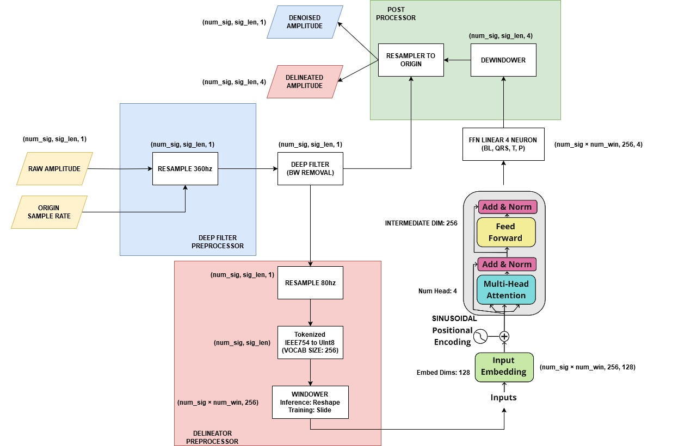
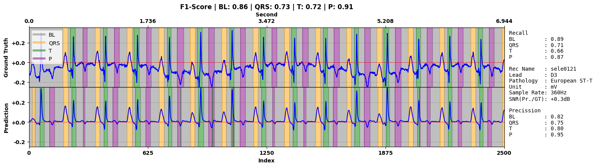

# ECG Deep Denoiser and Delineator

This project focuses on ECG denoising and delineation using deep learning techniques. The following steps will guide you through setting up the environment and running the training and evaluation scripts. Trained on LUDB and Evaluated on QTDB.

## Architecture



## Setup Instructions

1. **Download Dataset for Windows:**
  Execute the following command to download the required dataset:
  ```sh
  .\download_dataset.cmd
  ```

2. **Create Virtual Environment:**
  Create a virtual environment to manage dependencies:
  ```sh
  python -m venv .venv
  ```

3. **Install Dependencies:**
  Install the necessary Python packages using the provided requirements file:
  ```sh
  pip install -r requirements.txt
  ```

## Denoising
  For detailed instructions of the denoising model, please refer to the Deep Filter repository:
    [Deep Filter](https://github.com/fperdigon/DeepFilter)


## Delineation
- **Preprocessing:**
  """
  Preprocesses the delineation data locally for training purposes.

  This function performs preprocessing on the delineation data and returns the results in two formats:
  - .npz: A compressed file format that stores multiple NumPy arrays.
  - .pkl: A pickle file that serializes Python objects.

  Returns:
    npz: A compressed file containing the preprocessed NumPy arrays.
    pkl: A pickle file containing the serialized preprocessed data.
  """

- **Training:**
  Follow the training notebook available on Kaggle:
  [ECG Delineation 80Hz 256WinSize](https://www.kaggle.com/code/wawanikhwan/ecg-delineation-80hz-256winsize)

- **Evaluation on Unseen Data:**
  Evaluate the model on unseen data using the following Kaggle notebook:
  [QTDB Unseen Eval ECG Delineation 80Hz 256WinSize](https://www.kaggle.com/code/wawanikhwan/qtdb-unseen-eval-ecg-delineation-80hz-256winsize)

## Result



### QTDB Unseen Overall

| Classes | PPV  | TPR  | F1   | TNR  | NPV  | ACC  |
| ------- | ---- | ---- | ---- | ---- | ---- | ---- |
| BL      | 82.1 | 89   | 85.4 | 78.6 | 86.6 | 84   |
| QRS     | 90   | 73.3 | 80.8 | 98.7 | 95.9 | 95.2 |
| T       | 87.3 | 80.1 | 83.6 | 96.5 | 94.1 | 92.7 |
| P       | 74.9 | 75.3 | 75.1 | 97   | 97.1 | 94.7 |
| **Overall Accuracy** | **83.3** |
### QTDB Unseen Per Subject

| Record   | Lead    | Pathology             | Classes | PPV  | TPR  | F1   | TNR  | NPV  | ACC  |
| -------- | ------- | --------------------- | ------- | ---- | ---- | ---- | ---- | ---- | ---- |
| sel32    | ECG1    | Sudden Death (BIH)    | BL      | 75.3 | 95.8 | 84.3 | 73.9 | 95.4 | 83.8 |
|          |         |                       | QRS     | 96.6 | 55.8 | 70.7 | 99.6 | 91.3 | 91.8 |
|          |         |                       | T       | 90.7 | 80.2 | 85.1 | 97.3 | 93.7 | 93.1 |
|          |         |                       | P       | 92.7 | 77.5 | 84.4 | 99.2 | 97   | 96.6 |
|          |         |                       | **Overall Accuracy** | **82.6** |
| sel32    | ECG2    | Sudden Death (BIH)    | BL      | 75.4 | 77.4 | 76.4 | 66.9 | 69.2 | 72.8 |
|          |         |                       | QRS     | 93.3 | 64.6 | 76.3 | 99   | 92.6 | 92.7 |
|          |         |                       | T       | 51.4 | 55.2 | 53.2 | 89.7 | 91.1 | 84.1 |
|          |         |                       | P       | 52.3 | 70.3 | 60   | 94.1 | 97.1 | 92   |
|          |         |                       | **Overall Accuracy** | **70.8** |
| sel49    | ECG1    | Sudden Death (BIH)    | BL      | 63.5 | 88.4 | 73.9 | 50.8 | 81.9 | 69.3 |
|          |         |                       | QRS     | 77.8 | 67.3 | 72.2 | 97.5 | 95.9 | 94.1 |
|          |         |                       | T       | 92.6 | 36.8 | 52.7 | 98.5 | 76.1 | 78.3 |
|          |         |                       | P       | 60.9 | 79.8 | 69.1 | 96.4 | 98.6 | 95.3 |
|          |         |                       | **Overall Accuracy** | **68.5** |
| sel49    | ECG2    | Sudden Death (BIH)    | BL      | 72.4 | 94.7 | 82.1 | 61.1 | 91.4 | 78.5 |
|          |         |                       | QRS     | 94.5 | 38.4 | 54.6 | 99.5 | 88.6 | 89   |
|          |         |                       | T       | 85.3 | 70.5 | 77.2 | 96.1 | 91   | 89.8 |
|          |         |                       | P       | 30.2 | 23.1 | 26.1 | 96.3 | 94.8 | 91.6 |
|          |         |                       | **Overall Accuracy** | **74.5** |
| sel14046 | ECG1    | MIT-BIH Long-Term ECG | BL      | 85.7 | 88.8 | 87.2 | 82.9 | 86.5 | 86.1 |
|          |         |                       | QRS     | 91.6 | 81.1 | 86   | 98.9 | 97.2 | 96.6 |
|          |         |                       | T       | 90.7 | 85.5 | 88   | 97   | 95.1 | 94   |
|          |         |                       | P       | 65.9 | 75   | 70.2 | 96.8 | 97.9 | 95.2 |
|          |         |                       | **Overall Accuracy** | **85.9** |
| sel14046 | ECG2    | MIT-BIH Long-Term ECG | BL      | 95   | 78.7 | 86.1 | 93.5 | 73.9 | 84.5 |
|          |         |                       | QRS     | 68.6 | 92.2 | 78.7 | 95.7 | 99.2 | 95.4 |
|          |         |                       | T       | 70.9 | 89.8 | 79.3 | 92.2 | 97.7 | 91.8 |
|          |         |                       | P       | 81.2 | 98.1 | 88.9 | 96.8 | 99.7 | 96.9 |
|          |         |                       | **Overall Accuracy** | **84.3** |
| sel15814 | ECG1    | MIT-BIH Long-Term ECG | BL      | 74.8 | 81.7 | 78.1 | 81.3 | 86.7 | 81.4 |
|          |         |                       | QRS     | 99   | 75.8 | 85.8 | 99.8 | 93.2 | 94.2 |
|          |         |                       | T       | 92.2 | 85.4 | 88.6 | 97.3 | 94.6 | 94   |
|          |         |                       | P       | 56   | 79   | 65.6 | 93.8 | 97.8 | 92.5 |
|          |         |                       | **Overall Accuracy** | **81.1** |
| sel15814 | ECG2    | MIT-BIH Long-Term ECG | BL      | 69.3 | 95.1 | 80.2 | 68.1 | 94.9 | 79.7 |
|          |         |                       | QRS     | 99   | 73.7 | 84.5 | 99.8 | 93.2 | 94.1 |
|          |         |                       | T       | 94.7 | 79.6 | 86.5 | 98.4 | 93.2 | 93.5 |
|          |         |                       | P       | 59.4 | 17.6 | 27.2 | 98.8 | 92.4 | 91.5 |
|          |         |                       | **Overall Accuracy** | **79.4** |
